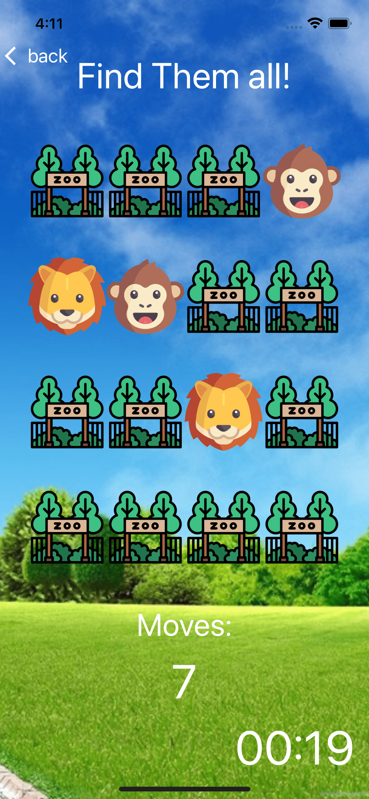
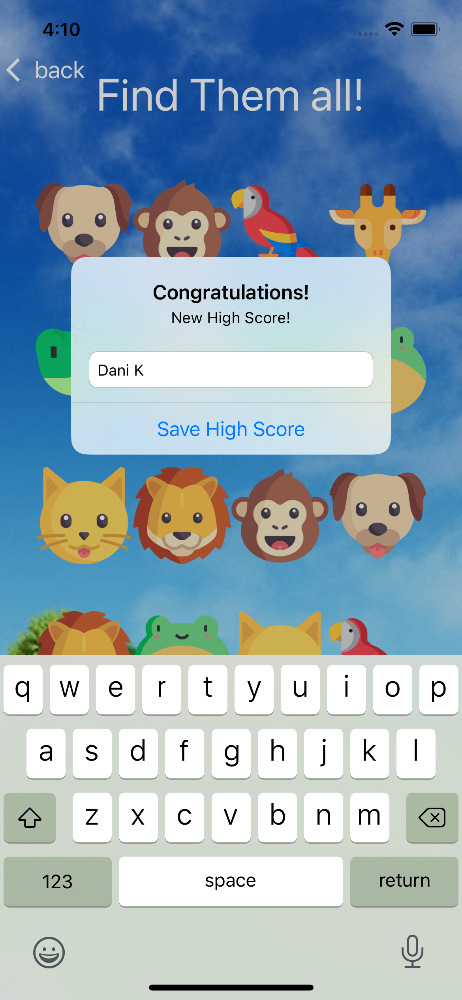

# Memory-Game
iOS memory game made with swift. <br>
Video of the game:  https://drive.google.com/file/d/1y1Ulz1SDnOlXKXY_tG22iK8XgP578CxM/view?usp=drive_web

## Screenshots:
### Main Screen 


### Gameplay




### Top Ten Screen


## License

```

Copyright 2021 Dani Koza

Licensed under the Apache License, Version 2.0 (the "License");

you may not use this file except in compliance with the License.

You may obtain a copy of the License at

https://github.com/DaniKoza/Memory-Game/blob/main/LICENSE

Unless required by applicable law or agreed to in writing, software

distributed under the License is distributed on an "AS IS" BASIS,

WITHOUT WARRANTIES OR CONDITIONS OF ANY KIND, either express or implied.

See the License for the specific language governing permissions and

limitations under the License.

```

